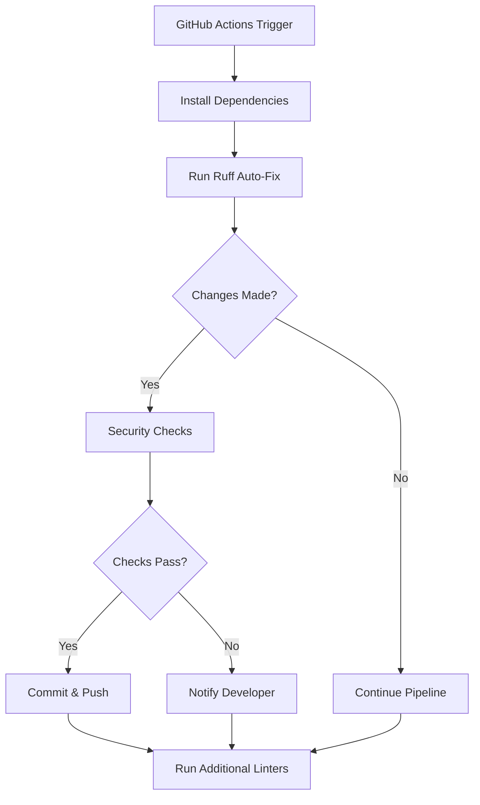

# GitHub Actions Code Quality Auto-Fix Workflow

## Overview

The code quality auto-fix workflow is an automated code quality enhancement system implemented in our CI/CD pipeline. It automatically fixes common code style and formatting issues using our custom `fix_linting_issues.py` script (which combines Black and Ruff), commits the changes, and pushes them back to the repository with proper security controls.

### Key Features

- Automated code formatting using Ruff
- Secure commit and push mechanism
- Integration with both pull requests and direct pushes
- Enhanced error reporting and developer notifications
- Change volume controls for safety

## Architecture



## Security Considerations

### Permissions Scoping

```yaml
permissions:
  contents: write    # For push branch
  pull-requests: write    # For PR updates
```

The workflow uses granular permissions scoping to ensure minimal required access:
- `contents: write`: Required only for pushing fixes
- `pull-requests: write`: Needed for PR updates and comments

### Git Bot Identity

Commits are made using a dedicated bot identity:
```bash
git config user.name "github-actions[bot]"
git config user.email "github-actions[bot]@users.noreply.github.com"
```

This ensures:
- Clear identification of automated changes
- Audit trail of automated fixes
- Separation from human commits

### Change Volume Limits

A safety threshold is implemented to prevent large-scale automated changes:
```bash
CHANGED_FILES=$(git diff --name-only | wc -l)
if [ "$CHANGED_FILES" -gt 50 ]; then
    echo "Too many files modified by auto-fix (${CHANGED_FILES}). Manual review needed."
    exit 1
fi
```

This control:
- Limits automated changes to 50 files maximum
- Requires manual review for larger changes
- Prevents unintended mass modifications

## Error Handling and Troubleshooting

### Common Issues and Solutions

1. **Permission Denied Errors**
   - Verify workflow permissions in repository settings
   - Check branch protection rules
   - Ensure bot account has necessary access

2. **Branch Checkout Failures**
   ```bash
   if [ -n "${GITHUB_HEAD_REF}" ]; then
       echo "Checking out PR branch: ${GITHUB_HEAD_REF}"
       git checkout "${GITHUB_HEAD_REF}" || {
           echo "Failed to checkout PR branch"
           exit 1
       }
   fi
   ```
   - Verify branch exists
   - Check for correct fetch depth
   - Review branch protection settings

3. **Ruff Installation Issues**
   ```bash
   pip install --no-cache-dir ruff
   ruff --version || { echo "ERROR: Ruff installation failed! Exiting..."; exit 1; }
   ```
   - Clear pip cache
   - Verify Python version compatibility
   - Check network connectivity

### Developer Notifications

The workflow provides detailed error reporting:
```bash
echo "::error::Ruff auto-fix encountered issues:"
echo "::group::Error Details"
echo "- Check the Ruff output above for specific formatting issues"
echo "- Review failing files manually"
echo "- Consider running 'ruff check --fix' locally"
```

Notifications include:
- Specific error messages
- Modified files list
- Suggested manual fixes
- Step-by-step troubleshooting guidance

## Maintenance Considerations

### Regular Maintenance Tasks

1. **Configuration Updates**
   - Review and update Ruff rules periodically
   - Adjust file change limits based on project needs
   - Update bot identity if needed

2. **Dependency Management**
   ```bash
   python -m pip install --upgrade pip setuptools wheel
   pip install --no-cache-dir ruff
   ```
   - Keep Ruff and dependencies updated
   - Monitor for breaking changes
   - Review compatibility with other tools

3. **Performance Monitoring**
   - Track workflow execution times
   - Monitor resource usage
   - Adjust timeouts if needed
   ```yaml
   timeout-minutes: 15
   ```

### Best Practices

1. **Version Control**
   - Keep workflow file under version control
   - Document changes in commit messages
   - Use semantic versioning for major changes

2. **Testing**
   - Test workflow changes in a feature branch
   - Verify permissions changes
   - Validate error handling

3. **Documentation**
   - Keep this document updated
   - Document new features and changes
   - Maintain troubleshooting guides

### Future Enhancements

Consider implementing:
- Integration with code review tools
- Custom rule configurations
- Advanced notification systems
- Analytics for auto-fix patterns

## Additional Resources

- [Ruff Documentation](https://github.com/astral-sh/ruff)
- [GitHub Actions Documentation](https://docs.github.com/en/actions)
- [Git Authentication in GitHub Actions](https://docs.github.com/en/actions/security-guides/automatic-token-authentication)
