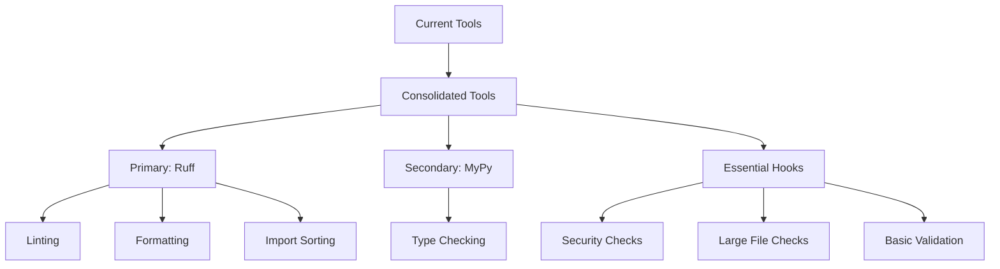
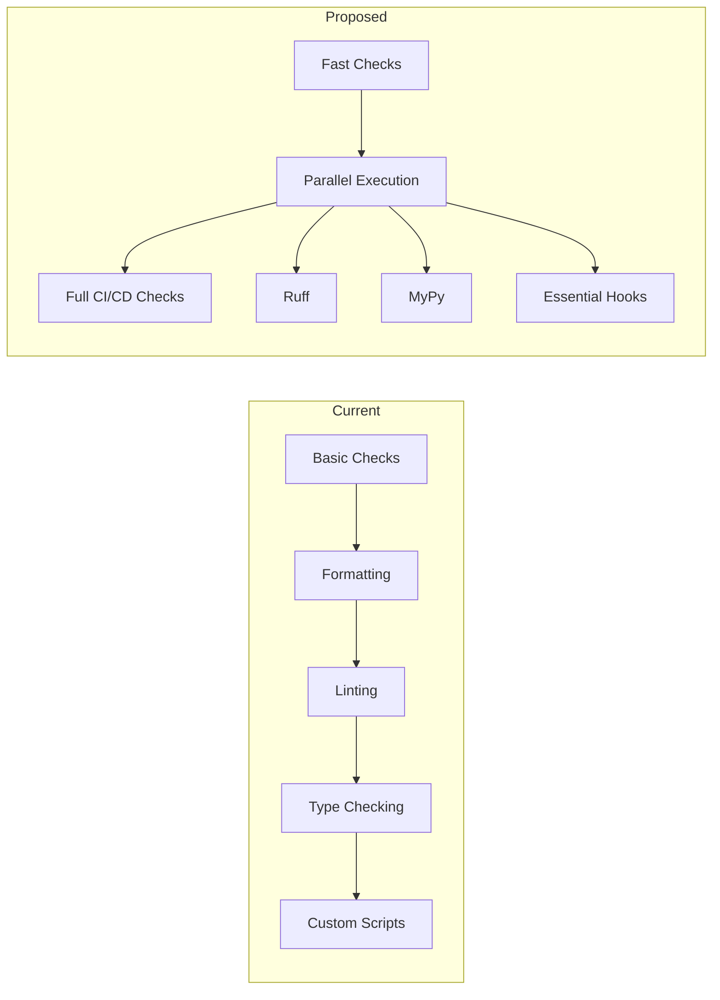

# Pre-commit Configuration Optimization Plan

## 1. Tool Consolidation Strategy

### Current Toolset Analysis
- **Ruff**: Handles linting and formatting
- **Black**: Additional formatting tools
- **MyPy**: Type checking
- **Pre-commit hooks**: Basic file checks
- **Custom scripts**: Various quality checks through unified management system

### Proposed Consolidation


### Tool Selection Rationale
1. **Keep**
   - Ruff: Fast, comprehensive, handles multiple tasks efficiently
   - MyPy: Essential for type checking, no equivalent alternative
   - Essential pre-commit hooks: For critical checks (secrets, large files)

2. **Remove**
   - Black: Redundant with Ruff's formatter
   - Duplicate file checks from unified system

## 2. Execution Pipeline Optimization

### Current vs Proposed Flow


### Pipeline Improvements
1. **Incremental Checks**
   - Run Ruff only on changed files
   - Cache MyPy results for faster subsequent runs
   - Skip unchanged files in pre-commit hooks

2. **Parallel Execution**
   - Run independent checks concurrently
   - Separate critical vs. non-critical checks

3. **CI/CD Integration**
   - Move comprehensive checks to CI/CD
   - Keep pre-commit focused on fast, essential checks

## 3. Configuration Simplification

### Configuration Consolidation
1. **Ruff Configuration**
   - Merge all linting rules into ruff.toml
   - Remove redundant configuration files
   - Standardize code style settings

2. **Pre-commit Config**
   - Streamline hooks configuration
   - Remove duplicate exclude patterns
   - Centralize common settings

### Proposed .pre-commit-config.yaml Structure
```yaml
exclude: &exclude_patterns
  (?x)^(
    \.venv/|
    venv/|
    \.git/|
    node_modules/|
    .*__pycache__/.*
  )$

repos:
  - repo: https://github.com/astral-sh/ruff-pre-commit
    rev: latest
    hooks:
      - id: ruff
        args: [--fix]
      - id: ruff-format

  - repo: https://github.com/pre-commit/mirrors-mypy
    rev: latest
    hooks:
      - id: mypy
        additional_dependencies: [types-all]

  - repo: https://github.com/pre-commit/pre-commit-hooks
    rev: latest
    hooks:
      - id: detect-private-key
      - id: check-added-large-files
```

## 4. Migration Plan

### Phase 1: Preparation (Week 1)
1. Document current tool configurations
2. Create backup of existing settings
3. Set up measurement metrics for performance baseline

### Phase 2: Tool Consolidation (Week 2)
1. Update Ruff configuration
2. Remove redundant tools
3. Update documentation

### Phase 3: Pipeline Optimization (Week 3)
1. Implement parallel execution
2. Set up caching mechanisms
3. Configure incremental checks

### Phase 4: Testing and Validation (Week 4)
1. Run performance benchmarks
2. Validate all checks still work
3. Document new workflow

### Risk Mitigation
1. **Potential Risks**
   - Missing checks during consolidation
   - Performance regressions
   - Developer workflow disruption

2. **Mitigation Strategies**
   - Comprehensive test suite for validation
   - Phased rollout with monitoring
   - Easy rollback procedure
   - Developer documentation and training

## 5. Expected Performance Improvements

### Metrics
1. **Execution Time**
   - Current: Full check on all files
   - Target: Incremental checks on changed files only
   - Expected improvement: 60-80% faster for typical commits

2. **Resource Usage**
   - Reduced CPU usage through parallel execution
   - Lower memory footprint from removing duplicate tools
   - Improved cache utilization

3. **Developer Experience**
   - Faster feedback cycles
   - Clearer error messages
   - Simplified configuration management

### Monitoring Plan
- Track execution times for different types of commits
- Monitor false positive/negative rates
- Collect developer feedback
- Regular performance audits
